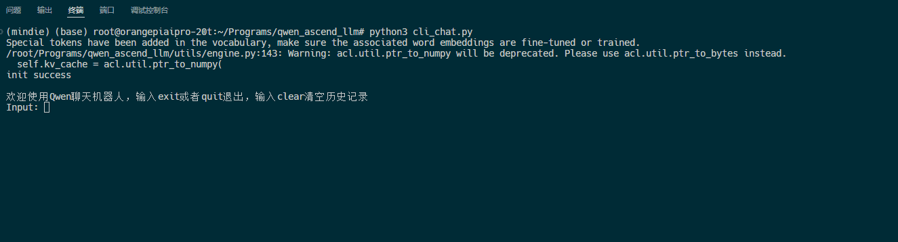

### 说明
- 本项目参考了[ascend-llm](https://gitee.com/yinghuo302/ascend-llm)项目。
- 仅在昇腾310B1做了测试，理论上也兼容其他昇腾芯片。
- 仅测试了qwen1.5-0.5b-chat与qwen2-1.5b-instruct模型，理论上支持qwen1.5/qwen2系列所有chat/instruct模型。

### 准备工作
1. 下载本项目
  ```bash
  git clone https://github.com/Tlntin/qwen-ascend-llm.git
  ```
2. 下载qwen1.5/qwen2的模型，选择chat模型或者instruct模型，将其放到download文件夹，仅支持huggingface下载的模型，网络不好的可以用镜像站：https://hf-mirror.com/Qwen


### 快速运行


### 分步骤运行
##### 步骤1：编译模型（以Qwen2-1.5B-Instruct）为例。
1. 导出onnx，默认kv-cache长度为1024，可以根据自己的内存、显存来设置更大参数。
  ```bash
  python3 export/export_onnx.py \
    --hf_model_dir="./download/Qwen2-1.5B-Instruct" \
    --onnx_model_path="./output/onnx/qwen2_1.5b_chat.onnx" \
    --kv_cache_length=1024
  ```

2. 验证onnx，返回项目根目录，运行cli_chat.py，测试一下onnx对话是否正常。
  ```bash
  python3 ./cli_chat.py \
    --session_type=onnx \
    --hf_model_dir="./download/Qwen2-1.5B-Instruct" \
    --onnx_model_path="./output/onnx/qwen2_1.5b_chat.onnx"
  ```

3. 改变onnx结构，目前导出的Trilu算子和Cast算子有些问题，atc命令无法识别，需要改一下结构。
  ```bash
  python3 export/change_node.py \
    --input_model_path="./output/onnx/qwen2_1.5b_chat.onnx" \
    --output_model_path="./output/onnx2/qwen2_1.5b_chat.onnx"
  ```

4. 转onnx为om模型, 将修改后的onnx利用atc命令导出到onnx，**注意此处的om_model_path不带`.om`后缀**。运行过程可能会有一些警告，或者子图融合报错，只要结果是提示`success`就说明没啥问题。kv_cache_length长度和第一步导出onnx时的长度保持一致。
  ```bash
  python3 export/onnx2om.py \
    --hf_model_dir="./download/Qwen2-1.5B-Instruct" \
    --onnx_model_path="./output/onnx2/qwen2_1.5b_chat.onnx" \
    --om_model_path="./output/model/qwen2_1.5b_chat" \
    --kv_cache_length=1024
  ```


##### 步骤2：运行模型
- 使用下面的命令直接运行模型
  ```bash
  python3 ./cli_chat.py \
    --hf_model_dir="./download/Qwen2-1.5B-Instruct" \
    --om_model_path="./output/model/qwen2_1.5b_chat.om"
  ```

- demo展示（演示模型，qwen1.5-0.5b-chat）



### 当前功能
- [x] 导出onnx, om模型
- [x] 模型推理，支持onnx推理（仅支持CPU）。
- [x] 模型推理，支持acl推理。
- [x] 流式传输
- [ ] 兼容OpenAI的api搭建
- [ ] 支持functional call
- [ ] 支持模型量化，如weight only, smooth quant等
- [ ] 支持Docker快速部署