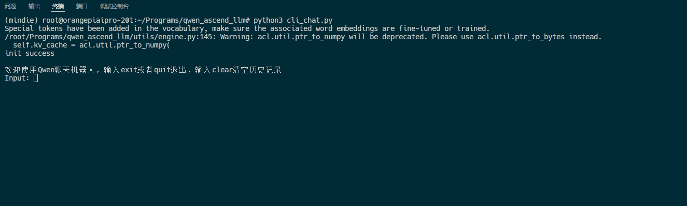
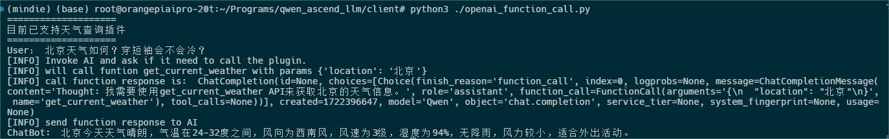

### 说明
- 本项目参考了[ascend-llm](https://gitee.com/yinghuo302/ascend-llm)项目。
- 仅在昇腾310B1与910A上面做了测试，理论上也兼容其他昇腾芯片。
- 仅测试了qwen1.5-0.5b-chat与qwen2-1.5b-instruct模型，理论上支持qwen1.5/qwen2系列所有chat/instruct模型。
- CANN环境安装可以参考[该教程](https://www.hiascend.com/forum/thread-0286155882998311250-1-1.html)。

### 准备工作
1. 下载本项目
  ```bash
  git clone https://github.com/Tlntin/qwen-ascend-llm.git
  ```

2. 下载qwen1.5/qwen2的模型，选择chat模型或者instruct模型，将其放到download文件夹，仅支持huggingface下载的模型，网络不好的可以用镜像站：https://hf-mirror.com/Qwen


### Docker运行相关
- （可选）构建部署用的docker。需要先参考[该教程](https://www.hiascend.com/forum/thread-0286157793000580492-1-1.html)登录并拉取镜像（建议跑通下面的所有步骤，得到.om文件后再编译docker）。
  ```bash
  docker build . -t qwen_ascend_llm
  ```

- （可选）构建开发用的docker。如果你想用docker来编译运行自定义芯片和自定义模型，可以运行下面的命令来构建镜像。同样的，需要先参考[该教程](https://www.hiascend.com/forum/thread-0286157793000580492-1-1.html)登录并拉取镜像
  ```bash
  docker build -f Dockerfile_dev . -t qwen_ascend_llm_dev
  ```

- 拉取编译好的镜像（仅适配昇腾310B1,例如香橙派AIPro 20T版）镜像内置了一个Qwen2-1.5B-Instruct模型以及对应的.om文件。
  ```bash
  docker pull registry.cn-guangzhou.aliyuncs.com/tlntin/qwen_ascend_llm:v0.0.1_310B1_arm64
  docker tag registry.cn-guangzhou.aliyuncs.com/tlntin/qwen_ascend_llm:v0.0.1_310B1_arm64 qwen_ascend_llm
  ```

- 启动部署用的容器（如果是开发用的容器，可以参考该脚本稍微修改，比如最底下的`python api.py`命令可以换成`sleep 8640000`让100天内不会关闭，然后加上-v 参数挂载一下download/output目录）。
  ```bash
  ./run_container.sh
  ```

- 查看容器日志，出现`INFO:     Uvicorn running on http://0.0.0.0:8000 (Press CTRL+C to quit)`则代表启动成功。
  ```bash
  docker logs qwen_ascend_llm
  ```

- 调用容器提供的api接口。进入本项目的client目录，可以运行里面的文件请求服务端。
  ```bash
  # openai_stream_client.py 流式请求，类似打字机效果，发送请求后立刻得到响应
  # openai_normal_client.py 非流式请求，需要等模型推理完再返回
  # openai_function_call.py 测试function_call，该功能启用时建议增加max_input_length和kv_cache_length的长度。
  ```


### 详细运行步骤
##### 步骤1：编译模型（以Qwen2-1.5B-Instruct）为例。
1. 除了上面说的CANN环境安装外，还需额外安装一些python模块。当然，你也可以使用docker构建开发环境，但是注意你的芯片和对应的得是310B系列，如果不是，需要参考官方镜像文档做一些修改。
  ```bash
  cd qwen-ascend-llm
  pip install -r ./requirements.txt
  ```
2. 导出onnx，默认kv-cache长度为1024，可以根据自己的内存、显存来设置更大参数。
  ```bash
  python3 export/export_onnx.py \
    --device_str=npu \
    --dtype=float16 \
    --hf_model_dir="./download/Qwen2-1.5B-Instruct" \
    --onnx_model_path="./output/onnx/qwen2_1.5b_chat.onnx" \
    --kv_cache_length=1024
  ```

3. 验证onnx，返回项目根目录，运行cli_chat.py，测试一下onnx对话是否正常（注意：由于是cpu运行，所以速度较慢，请耐心等待）。
  ```bash
  python3 ./cli_chat.py \
    --session_type=onnx \
    --hf_model_dir="./download/Qwen2-1.5B-Instruct" \
    --onnx_model_path="./output/onnx/qwen2_1.5b_chat.onnx"
  ```

4. 改变onnx结构，目前导出的Trilu算子和Cast算子有些问题，atc命令无法识别，需要改一下结构。
  ```bash
  python3 export/change_node.py \
    --input_model_path="./output/onnx/qwen2_1.5b_chat.onnx" \
    --output_model_path="./output/onnx2/qwen2_1.5b_chat.onnx"
  ```

5. 转onnx为om模型, 将修改后的onnx利用atc命令导出到onnx，**注意此处的om_model_path不带`.om`后缀**。运行过程可能会有一些警告，或者子图融合报错，只要结果是提示`success`就说明没啥问题。kv_cache_length长度和第一步导出onnx时的长度保持一致。`--max_prefill_length`为prefill阶段，单次能处理的最大长度，该数值越长则越能降低首字延迟，但是相应的onnx转om的时间也会变长。设置该数值时，一般为2的指数，例如2、4、8、16等等，推理时会利用递归自动匹配合适的prefill长度，例如输入12，会匹配[8, 4]。当前默认数值为8，如果设置为1，则不会开启动态shape推理功能。该脚本会自动检测你的NPU类型，如果你想手动指定，可以加上`--soc_version=xxxx`来指定，例如`--soc_version=Ascend310B1`
  ```bash
  python3 export/onnx2om.py \
    --hf_model_dir="./download/Qwen2-1.5B-Instruct" \
    --onnx_model_path="./output/onnx2/qwen2_1.5b_chat.onnx" \
    --om_model_path="./output/model/qwen2_1.5b_chat" \
    --kv_cache_length=1024 \
    --max_prefill_length=8
  ```


##### 步骤2：在终端运行模型进行对话
- 使用下面的命令直接运行模型，`--max_prefill_length`需要和上面编译的时候使用的数值相同。
  ```bash
  python3 ./cli_chat.py \
    --hf_model_dir="./download/Qwen2-1.5B-Instruct" \
    --om_model_path="./output/model/qwen2_1.5b_chat.om" \
    --max_prefill_length=8
  ```

- demo展示1（演示模型，qwen1.5-0.5b-chat，未开启动态shape推理）


- demo展示2（演示模型，qwen2-1.5b-instruct，开启动态shape推理, max_prefill_length=8）



##### 步骤3：部署兼容OpenAI的api
- 使用下面的命令直接运行api，`--max_prefill_length`需要和上面编译的时候使用的数值相同。
  ```bash
  python3 ./api.py \
    --hf_model_dir="./download/Qwen2-1.5B-Instruct" \
    --om_model_path="./output/model/qwen2_1.5b_chat.om" \
    --max_prefill_length=8
  ```

- 进入client目录，可以运行里面的文件请求服务端。
  ```bash
  # openai_stream_client.py 流式请求，类似打字机效果，发送请求后立刻得到响应
  # openai_normal_client.py 非流式请求，需要等模型推理完再返回
  # openai_function_call.py 测试function_call，该功能启用时建议增加max_input_length和kv_cache_length的长度。
  ```

- functional_call demo展示(使用qwen2-1.5b-instruct)

### 当前功能
- [x] 导出onnx, om模型
- [x] 模型推理，支持onnx推理（仅支持CPU）。
- [x] 模型推理，支持CANN推理。
- [x] CANN推理时使用动态shape推理以降低首字延迟。
- [x] 流式传输
- [x] 兼容OpenAI的api搭建
- [x] 支持functional call
- [ ] 支持模型量化，如weight only, smooth quant等
- [x] 支持Docker快速部署
